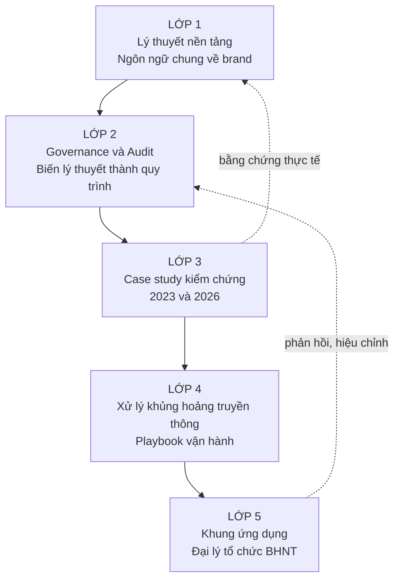
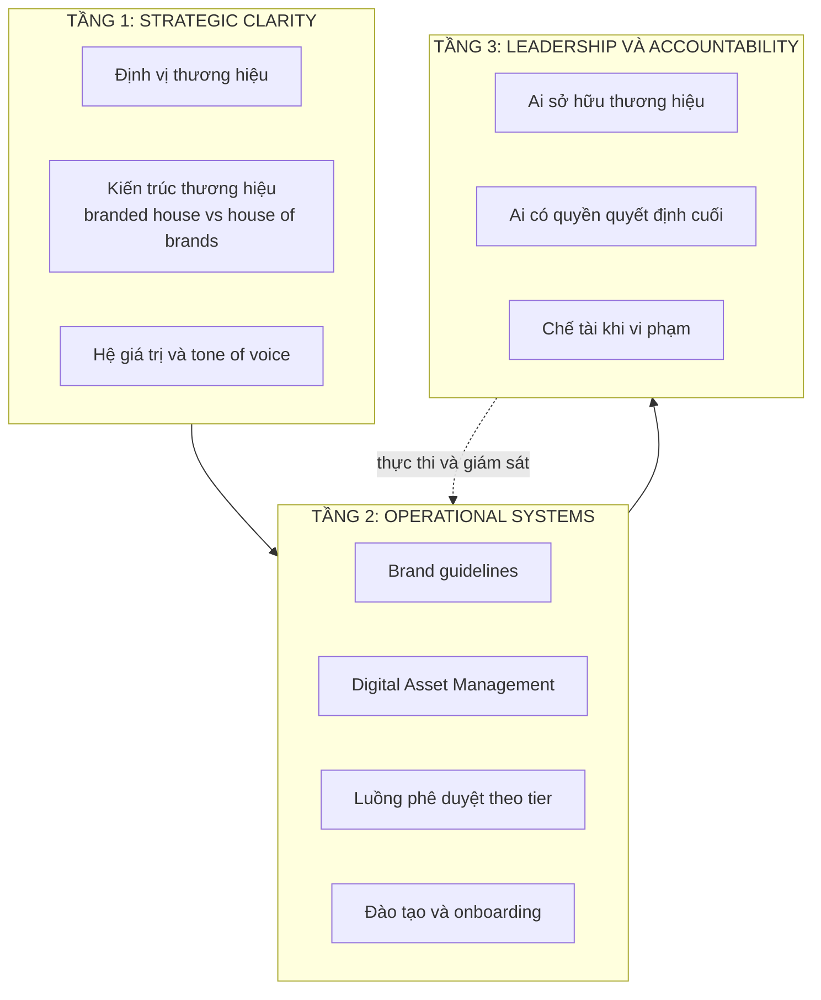
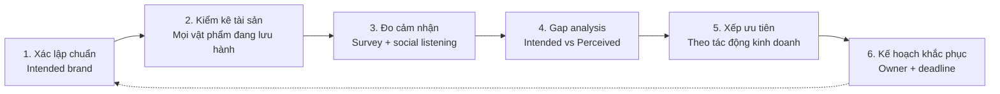
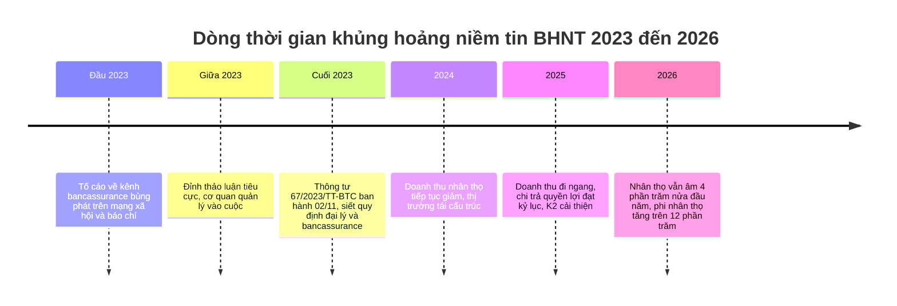
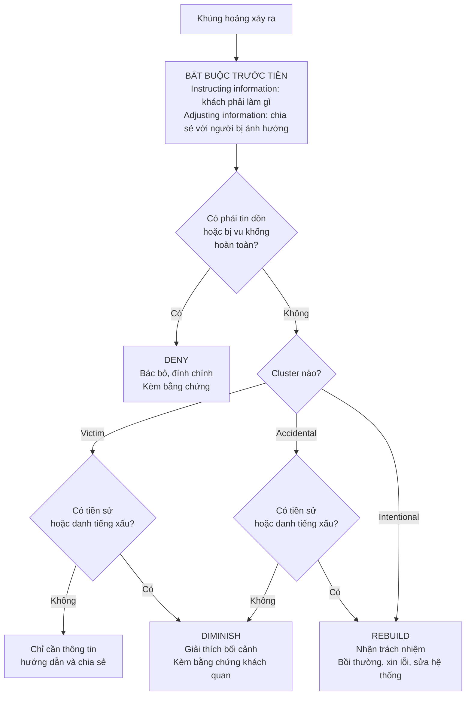
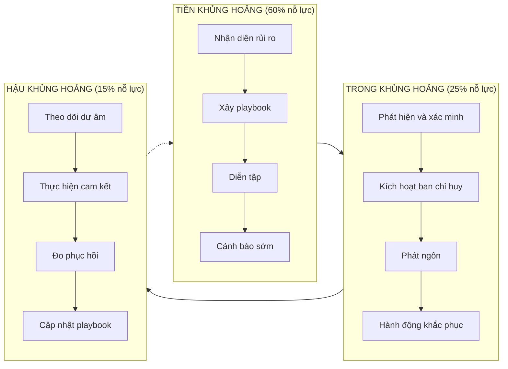

# Quản trị thương hiệu và xử lý khủng hoảng truyền thông ngành Bảo hiểm Nhân thọ Việt Nam

**Phiên bản 2.0** | Cập nhật 08/2026 | Tài liệu học tập và tham chiếu vận hành

---

## Cách dùng tài liệu

| Mục | Nội dung |
|---|---|
| Đối tượng | Head of Marketing / Brand Lead tại doanh nghiệp bảo hiểm hoặc đại lý tổ chức |
| Cấu trúc | 5 lớp, đọc tuần tự hoặc tra cứu độc lập từng lớp |
| Thay đổi so với v1.0 | Bổ sung Lớp 4 (xử lý khủng hoảng truyền thông, hoàn toàn mới), bổ sung case study 2026, sửa 1 lỗi quy gán mô hình, thay toàn bộ hình ảnh bằng biểu đồ dạng text/mermaid, cập nhật số liệu thị trường tới 6T/2026 |
| Lưu ý khi trích dẫn | Tài liệu dùng tên thật của các case đã công khai trên báo chí. Khi đưa vào slide hoặc báo cáo trình leadership, thay bằng quy ước "Other vendor 1", "Other vendor 2" |
| Ký hiệu trạng thái | 🔴 nghiêm trọng / 🟡 cần theo dõi / 🟢 trong ngưỡng an toàn |

**Bản đồ 5 lớp**



Logic liên kết: Lớp 1 cung cấp khái niệm. Lớp 2 biến khái niệm thành quy trình lặp lại được. Lớp 3 cho thấy hệ thống hỏng thì trông như thế nào. Lớp 4 là quy trình chữa cháy khi hệ thống đã hỏng. Lớp 5 gộp tất cả thành checklist hành động.

---

# LỚP 1: LÝ THUYẾT NỀN TẢNG

## 1.1 Phân biệt 6 khái niệm hay bị dùng lẫn

Đây là nguồn gốc của phần lớn tranh cãi vô ích trong các cuộc họp brand. Nắm bảng này trước khi đọc tiếp.

| Khái niệm | Định nghĩa 1 câu | Ai sở hữu | Đo bằng gì | Ví dụ BHNT |
|---|---|---|---|---|
| **Brand identity** | Điều thương hiệu muốn được hiểu | Doanh nghiệp | Tài liệu định vị, brand book | "Người bạn đồng hành bảo vệ gia đình" |
| **Brand image** | Điều khách hàng thực sự nghĩ | Khách hàng | Survey, social listening | "Công ty khó đòi tiền" |
| **Brand positioning** | Vị trí muốn chiếm trong tâm trí so với đối thủ | Doanh nghiệp | Perceptual map | "Bảo vệ thuần túy, không phải kênh đầu tư" |
| **Brand equity** | Giá trị cộng thêm nhờ cái tên | Cả hai | Price premium, retention, thị phần | Khách chấp nhận phí cao hơn 10% |
| **Brand reputation** | Đánh giá tích lũy qua thời gian của mọi bên liên quan | Xã hội | Xếp hạng uy tín, media sentiment | Top 10 uy tín Vietnam Report |
| **Brand valuation** | Con số tiền tệ gán cho thương hiệu | Bên định giá | Interbrand, BrandZ, ISO 10668 | Giá trị thương hiệu tính bằng USD |

**Khoảng cách identity trừ image chính là bài toán trung tâm của quản trị thương hiệu.** Khủng hoảng xảy ra khi khoảng cách này vượt ngưỡng chịu đựng của công chúng.

## 1.2 Lăng kính bản sắc Kapferer, điền sẵn cho BHNT

Kapferer chia bản sắc thương hiệu thành 6 mặt, sắp theo 2 trục: dọc là Người gửi (thương hiệu) và Người nhận (khách hàng), ngang là Hướng ngoại (hữu hình) và Hướng nội (tinh thần).[4]

```
                    NGƯỜI GỬI (thương hiệu tự thể hiện)
    ┌──────────────────────────┬──────────────────────────┐
    │  1. PHYSIQUE             │  2. PERSONALITY          │
    │  Vật lý, hữu hình        │  Tính cách               │
    │  Logo, màu, đồng phục    │  Giọng nói thương hiệu   │
H   │  tư vấn viên, app,       │  Điềm đạm hay nhiệt tình?│   H
Ư   │  hợp đồng giấy           │  Chuyên gia hay bạn bè?  │   Ư
Ớ   ├──────────────────────────┼──────────────────────────┤   Ớ
N   │  3. RELATIONSHIP         │  4. CULTURE              │   N
G   │  Kiểu quan hệ            │  Hệ giá trị gốc          │   G
    │  Giao dịch một lần hay   │  Gốc Nhật: cẩn trọng,    │
N   │  đồng hành 20 năm?       │  dài hạn, chữ tín        │   N
G   ├──────────────────────────┼──────────────────────────┤   Ộ
O   │  5. REFLECTION           │  6. SELF-IMAGE           │   I
À   │  Hình ảnh người dùng     │  Khách tự thấy mình      │
I   │  trong mắt xã hội        │  thế nào khi mua         │
    │  "Người biết lo xa"      │  "Tôi là trụ cột gia     │
    │                          │   đình có trách nhiệm"   │
    └──────────────────────────┴──────────────────────────┘
                    NGƯỜI NHẬN (khách hàng cảm nhận)
```

**Cách dùng thực chiến:** điền 6 ô cho thương hiệu của mình, rồi điền 6 ô theo cảm nhận thật của khách qua phỏng vấn hoặc social listening. Ô nào lệch nhiều nhất là ưu tiên xử lý số 1.

Ví dụ lệch điển hình trong ngành BHNT Việt Nam giai đoạn 2023: ô Relationship do doanh nghiệp thiết kế là "đồng hành trọn đời", ô Relationship khách hàng cảm nhận là "bán xong là biến mất". Lệch 100%.

## 1.3 Hệ thống bản sắc Aaker

Aaker chia bản sắc thành **core identity** (phần bất biến, tồn tại kể cả khi đổi thị trường hoặc sản phẩm) và **extended identity** (phần bổ trợ tạo chiều sâu và độ cụ thể), tổ chức quanh 4 góc nhìn: sản phẩm, tổ chức, con người, biểu tượng.[5]

| Góc nhìn | Câu hỏi kiểm tra | Áp dụng BHNT |
|---|---|---|
| Brand as product | Phạm vi, thuộc tính, chất lượng, người dùng, xuất xứ | Bảo vệ hay đầu tư? Xuất xứ Nhật có phải tài sản? |
| Brand as organization | Đặc tính tổ chức, nội địa hay toàn cầu | Quy mô tập đoàn, lịch sử, năng lực chi trả |
| Brand as person | Tính cách, quan hệ khách hàng | Cố vấn tài chính hay người bán hàng? |
| Brand as symbol | Hình ảnh, ẩn dụ, di sản | Logo, màu, biểu tượng, câu chuyện thương hiệu |

Điểm quan trọng cho ngành bảo hiểm: **góc nhìn "brand as organization" quan trọng hơn hẳn so với ngành hàng tiêu dùng.** Khách mua một lời hứa chi trả sau 20 năm, nên năng lực tài chính và tuổi đời tổ chức là thuộc tính thương hiệu, không phải thông tin phụ.

## 1.4 Ba trường phái đo brand equity

**Đây là chỗ bản v1.0 có lỗi.** Bản v1.0 ghi "Mô hình Aaker về brand equity nhấn mạnh năm chiều: awareness, relevance, esteem, knowledge, differentiation". Bốn chiều differentiation, relevance, esteem, knowledge thuộc mô hình **BrandAsset Valuator (BAV)** của Young & Rubicam, không phải Aaker. Aaker dùng 5 chiều khác.[60][61]

| Mô hình | Tác giả | Các chiều | Dùng khi nào |
|---|---|---|---|
| **Brand Equity 5 tài sản** | Aaker (1991) | Brand loyalty, brand awareness, perceived quality, brand associations, other proprietary assets | Chẩn đoán nội bộ, phân bổ ngân sách |
| **CBBE Pyramid** | Keller | Salience, Performance + Imagery, Judgments + Feelings, Resonance | Thiết kế lộ trình xây thương hiệu từ 0 |
| **BrandAsset Valuator** | Young & Rubicam | Differentiation, Relevance, Esteem, Knowledge | So sánh chuẩn với đối thủ cùng ngành |

**Kim tự tháp CBBE của Keller, đọc từ dưới lên**

```
                        ┌─────────────┐
                Tầng 4  │  RESONANCE  │   Khách chủ động giới thiệu,
                        │  Cộng hưởng │   gắn bó, tự nhận là "người nhà"
                        └─────────────┘
                   ┌──────────┬──────────┐
           Tầng 3  │JUDGMENTS │ FEELINGS │  Đánh giá lý tính +
                   │ Đánh giá │  Cảm xúc │  cảm xúc với thương hiệu
                   └──────────┴──────────┘
              ┌──────────────┬──────────────┐
      Tầng 2  │ PERFORMANCE  │   IMAGERY    │  Sản phẩm làm được gì +
              │   Hiệu năng  │  Liên tưởng  │  gợi hình ảnh gì
              └──────────────┴──────────────┘
         ┌────────────────────────────────────┐
 Tầng 1  │            SALIENCE                │  Nhớ đến ai đầu tiên
         │          Độ nổi bật                │  khi nghĩ tới bảo hiểm
         └────────────────────────────────────┘

  Câu hỏi tương ứng từng tầng:
  Tầng 1: "Bạn là ai?"          Tầng 3: "Tôi nghĩ gì, thấy gì về bạn?"
  Tầng 2: "Bạn là cái gì?"      Tầng 4: "Tôi và bạn quan hệ thế nào?"
```

**Ánh xạ CBBE sang chỉ số đo được của BHNT**

| Tầng CBBE | Chỉ số đo | Nguồn dữ liệu | Tần suất |
|---|---|---|---|
| Salience | Unaided awareness, Share of Search | Brand tracking, Google Trends | Quý |
| Performance | Tỷ lệ chi trả đúng hạn, thời gian xử lý claim | Hệ thống nội bộ | Tháng |
| Imagery | Từ khóa liên tưởng trong social listening | Social listening | Tuần |
| Judgments/Feelings | NPS, sentiment ratio | Survey, social listening | Tháng |
| Resonance | Tỷ lệ tái tục K2/K3, tỷ lệ giới thiệu | Hệ thống nội bộ | Tháng |

**Chỉ số quan trọng nhất với BHNT là K2 (tỷ lệ duy trì hợp đồng năm thứ hai).** K2 là thước đo brand equity trung thực nhất của ngành này, vì nó đo hành vi trả tiền lần thứ hai sau khi khách đã hết hưng phấn mua hàng và đã hiểu rõ sản phẩm. Một chiến dịch marketing có thể đẩy doanh thu khai thác mới, nhưng không thể làm giả K2.

## 1.5 Định giá thương hiệu, mức độ nâng cao

Ba phương pháp phổ biến, cùng chung logic: tách phần lợi nhuận do thương hiệu tạo ra khỏi phần do tài sản khác tạo ra.

| Phương pháp | Công thức rút gọn | Ưu | Nhược |
|---|---|---|---|
| Interbrand | Lợi nhuận kinh tế × Vai trò thương hiệu × Điểm mạnh thương hiệu | Có chuẩn quốc tế, được công nhận | Cần dữ liệu tài chính chi tiết |
| BrandZ (Kantar) | Giá trị tài chính × Đóng góp thương hiệu (từ khảo sát người tiêu dùng) | Nặng về dữ liệu người tiêu dùng | Chi phí khảo sát cao |
| ISO 10668 | Khung tiêu chuẩn, cho phép dùng income/market/cost approach | Được chấp nhận trong kiểm toán | Chỉ là khung, không phải công thức |

Với đại lý tổ chức chưa cần định giá chính thức, giá trị thực tế của phần này là **hiểu logic "vai trò thương hiệu"**: bao nhiêu phần trăm quyết định mua đến từ cái tên, bao nhiêu đến từ giá, kênh phân phối, hoặc quan hệ cá nhân của tư vấn viên. Trong ngành BHNT Việt Nam, tỷ trọng quan hệ cá nhân của tư vấn viên rất cao, nghĩa là **brand equity của doanh nghiệp thấp hơn cảm giác chủ quan của đội marketing.**

---

# LỚP 2: GOVERNANCE VÀ AUDIT

Khác biệt giữa "hiểu brand" và "quản trị brand" nằm ở lớp này. Lớp 1 là kiến thức, lớp 2 là quy trình lặp lại được.

## 2.1 Kiến trúc governance 3 tầng



Tầng 1 thiếu thì tầng 2 thành bộ quy tắc hình thức. Tầng 3 thiếu thì tầng 2 thành tài liệu không ai đọc. **Phần lớn doanh nghiệp Việt Nam làm tầng 2 rồi bỏ trống tầng 3.**

## 2.2 Phân tier vật phẩm truyền thông theo rủi ro

Đây là công cụ vận hành có giá trị nhất của lớp governance. Nguyên tắc: **mức kiểm soát tỷ lệ thuận với rủi ro pháp lý và độ hiển thị công chúng**, không phải với chi phí sản xuất.

| Tier | Loại vật phẩm | Rủi ro | Ai được sửa | Ai duyệt cuối | SLA duyệt |
|---|---|---|---|---|---|
| **Tier 0** 🔴 | Nội dung mô tả quyền lợi sản phẩm, minh họa quyền lợi, so sánh sản phẩm | Pháp lý cao, có thể dẫn tới khiếu nại và chế tài | Không ai. Khóa cứng | Doanh nghiệp bảo hiểm (BVL) + Compliance | 5 đến 10 ngày làm việc |
| **Tier 1** 🔴 | Nội dung công khai gắn tên thương hiệu: fanpage, website, TVC, PR | Danh tiếng cao, khó thu hồi | Marketing, trong khuôn mẫu | Head of Marketing + Legal | 2 đến 3 ngày làm việc |
| **Tier 2** 🟡 | Saleskit, flipbook, tài liệu đào tạo nội bộ cho tư vấn viên | Trung bình, lan gián tiếp qua tư vấn viên | Marketing + Training | Head of Marketing | 1 đến 2 ngày làm việc |
| **Tier 3** 🟢 | Vật phẩm nội bộ không chứa thông tin sản phẩm: backdrop sự kiện, quà tặng, template slide | Thấp | Bất kỳ ai theo template | Trưởng bộ phận đề xuất | Trong ngày |

**Ranh giới cần viết rõ trong quy chế:** vật phẩm do bên thứ ba (đại lý, tổng đại lý, đối tác) sản xuất nhưng đăng trên kênh chính thức của công ty luôn được xếp Tier 1 trở lên, bất kể nội dung.

**Bổ sung cho 2026: quy tắc vật phẩm tạo bằng AI.** Đây là khoảng trống mà hầu hết brand guideline Việt Nam chưa lấp. Đề xuất khung tối thiểu:

| Tình huống | Quy tắc đề xuất |
|---|---|
| Hình AI trong tài liệu nội bộ, saleskit, flipbook | Cho phép, kèm ghi chú nguồn trong metadata |
| Hình AI trên kênh công khai (fanpage, website) | Chỉ cho phép khi không có người thật, không mô tả tình huống bồi thường, không gợi ý kết quả tài chính |
| Hình AI mô phỏng khách hàng thật, gia đình thật, tình huống rủi ro thật | Cấm. Rủi ro hiểu lầm là chứng thực thật |
| Hình AI mô phỏng nhân sự công ty, văn phòng, giải thưởng | Cấm tuyệt đối. Đây là bịa đặt bằng chứng |
| Ghi nhãn | Vật phẩm công khai tạo bằng AI phải có nhãn nhận diện theo chuẩn nội bộ |

## 2.3 Ma trận RACI cho brand governance

| Hoạt động | Marketing | Legal/Compliance | Kinh doanh | Ban lãnh đạo | Doanh nghiệp BH |
|---|---|---|---|---|---|
| Định vị thương hiệu | R | C | C | A | I |
| Viết brand guideline | R | C | I | A | I |
| Duyệt nội dung Tier 0 | C | R | I | I | A |
| Duyệt nội dung Tier 1 | R | C | I | A | I |
| Kiểm tra tuân thủ kênh phân phối | C | R | R | A | I |
| Brand audit định kỳ | R | C | C | A | I |
| Kích hoạt quy trình khủng hoảng | R | C | I | A | C |

R: thực hiện. A: chịu trách nhiệm cuối. C: được hỏi ý kiến. I: được thông báo.

## 2.4 Brand audit: vòng phản hồi của hệ thống

Không có audit thì governance vận hành mù. Audit trả lời một câu hỏi duy nhất: **khoảng cách giữa điều ta muốn nói và điều thị trường đang nghe là bao nhiêu, và nó có đang giãn ra không.**

Quy trình 6 bước:



**Con số cần biết:** khảo sát thực tế cho thấy 40 đến 60 phần trăm tài liệu marketing chứa nội dung lỗi thời hoặc lệch chuẩn ở lần audit đầu tiên.[11][12] Con số này cao đến mức phần lớn tổ chức không tin, cho tới khi tự kiểm kê.

**Bảng kết quả gap analysis, mẫu điền**

| Thuộc tính | Ta muốn nói (1-10) | Thị trường đang nghe (1-10) | Gap | Tác động kinh doanh | Ưu tiên |
|---|---|---|---|---|---|
| Minh bạch quyền lợi | 9 | 4 | -5 | Trực tiếp lên K2 | 🔴 P1 |
| Chi trả nhanh | 9 | 5 | -4 | Trực tiếp lên NPS và giới thiệu | 🔴 P1 |
| Uy tín tập đoàn mẹ | 8 | 7 | -1 | Gián tiếp | 🟢 P3 |
| Sản phẩm dễ hiểu | 7 | 3 | -4 | Trực tiếp lên tỷ lệ hủy năm 1 | 🔴 P1 |
| Tư vấn viên chuyên nghiệp | 9 | 4 | -5 | Trực tiếp lên khiếu nại | 🔴 P1 |

Cột "Tác động kinh doanh" là cột quyết định thứ tự xử lý, không phải cột Gap. Gap lớn ở thuộc tính không ảnh hưởng doanh thu thì để sau.

## 2.5 Bộ chỉ số theo dõi thương hiệu cho BHNT

| Nhóm | Chỉ số | Ngưỡng cảnh báo | Tần suất |
|---|---|---|---|
| Nhận biết | Unaided awareness, Share of Search | Giảm trên 10% QoQ 🟡 | Quý |
| Cảm xúc | Negative sentiment ratio | Vượt 25% tổng thảo luận 🟡, vượt 40% 🔴 | Tuần |
| Khối lượng | Số lượt đề cập theo ngày | Tăng trên 3 lần trung bình 30 ngày 🔴 | Hàng ngày |
| Trải nghiệm | NPS, thời gian xử lý claim | NPS âm 🔴 | Tháng |
| Hành vi | K2, tỷ lệ hủy năm 1, tỷ lệ khiếu nại | K2 giảm trên 3 điểm phần trăm YoY 🔴 | Tháng |
| Nhân sự | Tỷ lệ rời ngành của tư vấn viên | Tăng trên 20% YoY 🟡 | Quý |

Ba chỉ số ở nhóm Hành vi là chỉ số cuối cùng, phản ánh brand equity thật. Ba nhóm trên là chỉ số dẫn dắt, cảnh báo sớm hơn nhưng dễ nhiễu.
---

# LỚP 3: KIỂM CHỨNG THỰC TẾ

Hai case, hai mô hình kinh doanh khác nhau, cùng một cơ chế thất bại.

## 3.1 Case A: Khủng hoảng bancassurance 2023

### Diễn biến



### Số liệu mức độ nghiêm trọng

| Chỉ số | Giá trị | Nguồn |
|---|---|---|
| Doanh nghiệp và chuyên gia coi thông tin tiêu cực là thách thức lớn nhất 2023 | **81,8%** | Vietnam Report [15] |
| Lượt thảo luận đỉnh điểm | **73.000 lượt/ngày** | Social listening [15] |
| Mức tăng chỉ số cảm xúc tiêu cực của khách hàng | **19 lần** | Social listening [15] |
| Tiền và tương đương tiền của doanh nghiệp trung tâm khủng hoảng tại 30/06/2023 | Giảm **1.676 tỷ đồng**, tương đương **giảm 40%**, còn 2.556 tỷ | Báo cáo tài chính [19] |
| Hệ quả xếp hạng | Bị loại khỏi Top 10 BHNT uy tín 2023, lý do là khủng hoảng truyền thông chứ không phải hiệu quả kinh doanh | Vietnam Report [14] |

### Nguyên nhân gốc, phân tích 5 Whys

| Cấp | Câu hỏi | Trả lời |
|---|---|---|
| Why 1 | Vì sao thương hiệu bị tổn hại? | Khách hàng công khai tố bị lừa dối |
| Why 2 | Vì sao khách cảm thấy bị lừa? | Sản phẩm liên kết đầu tư được bán như sản phẩm tiết kiệm ngân hàng |
| Why 3 | Vì sao tư vấn sai xảy ra ở quy mô lớn? | Nhân viên ngân hàng bị giao KPI bảo hiểm, thiếu năng lực và động cơ tư vấn đúng |
| Why 4 | Vì sao doanh nghiệp bảo hiểm không phát hiện sớm? | Không có cơ chế giám sát chất lượng tư vấn tại điểm bán của bên thứ ba |
| Why 5 | Vì sao không có cơ chế đó? | **Brand governance chỉ phủ nội dung do phòng brand sản xuất, không phủ hành vi tại điểm tiếp xúc** |

Đây là kết luận cốt lõi của toàn bộ case. Thiệt hại thương hiệu không đến từ quảng cáo sai, mà từ **hành vi bán hàng tại điểm tiếp xúc mà brand governance không chạm tới.**

### Đường phục hồi, dữ liệu tới giữa 2026

Doanh thu phí bảo hiểm nhân thọ toàn thị trường:

```
Đơn vị: nghìn tỷ đồng

2025 thực tế   ████████████████████████████████████  148,8   đi ngang
2026 dự kiến   █████████████████████████████████████ 151,8   +2,0%

Tăng trưởng doanh thu phí theo khối, 6 tháng đầu 2026:

Phi nhân thọ   ████████████████████████  +12%   🟢
Toàn ngành     ████                       +2%   🟡
Nhân thọ       ◄◄◄◄◄◄◄◄                   -4%   🔴
```

| Chỉ số phục hồi | Giá trị 2025 | Ý nghĩa |
|---|---|---|
| Tổng doanh thu phí toàn thị trường | **237,2 nghìn tỷ**, tăng khoảng 4% | Đà suy giảm đã chững |
| Chi trả quyền lợi bảo hiểm | **91.845 tỷ**, tăng **13,52%**, mức kỷ lục | Bằng chứng vật chất cho lời hứa thương hiệu |
| Tổng tài sản toàn ngành | Trên **1,1 triệu tỷ**, tăng 8,58% | Năng lực tài chính không suy giảm |
| Doanh nghiệp tăng doanh thu | 52,9% | Phục hồi phân hóa, không đồng đều |
| Doanh nghiệp tăng lợi nhuận | 53,0%, trong đó 32,4% tăng trên 25% | Hiệu quả vận hành cải thiện |
| Kỳ vọng tăng trưởng 2026 của doanh nghiệp | **87,5%** kỳ vọng ngành tăng 5 đến 10% | Tâm lý ngành đã đảo chiều |
| Hợp đồng có hiệu lực (cuối 6/2025) | 11.905.495, giảm 0,9% YoY | Quy mô tệp khách vẫn chưa tăng lại |

**Ghi chú mâu thuẫn dữ liệu:** một nguồn ghi ngành trải qua ba năm liên tiếp doanh thu suy giảm sau 2023 [18], một nguồn khác ghi hai năm tăng trưởng âm rồi đi ngang năm 2025 [53]. Chênh lệch đến từ cách tính (tổng phí hay phí khai thác mới, số ước tính hay số quyết toán). Khi trích dẫn cho báo cáo nội bộ, cần ghi rõ chọn định nghĩa nào.

**Bài học đo được:** thời gian phục hồi brand equity cấp ngành sau một khủng hoảng niềm tin là **trên 3 năm**, và tính đến giữa 2026 vẫn chưa hoàn tất. So sánh: chi phí một chiến dịch truyền thông rẻ hơn rất nhiều so với 3 năm doanh thu âm.

## 3.2 Case B: Khủng hoảng mô hình phân phối 2026

Case này quan trọng hơn với đại lý tổ chức, vì đối tượng chịu khủng hoảng chính là một tổng đại lý, cùng mô hình kinh doanh.

### Diễn biến, ghi theo mốc công khai

| Thời điểm | Sự kiện |
|---|---|
| 12/01/2026 | Báo chí đưa tin về mô hình chi trả "đồng chia" cho tất cả người tham gia khi thỏa mãn điều kiện, được giới thiệu là "chưa từng có" |
| 13 đến 19/01/2026 | Chuyên gia cảnh báo mô hình có dấu hiệu xây dựng mạng lưới phân phối đa cấp, cấu trúc 8 cấp bị đặt câu hỏi |
| 17/01/2026 | Phân tích chỉ ra rủi ro khi truyền thông nhập nhằng giữa quyền lợi hợp đồng và chương trình thưởng, thiếu văn bản pháp lý ràng buộc và kiểm toán độc lập |
| 22/01/2026 | Chuyên gia đánh giá cách truyền thông "đồng chia hàng tuần, trọn đời" có dấu hiệu vi phạm pháp luật quảng cáo và bảo vệ người tiêu dùng |
| 29 đến 30/01/2026 | Chủ tịch một tổ chức nghề nghiệp cảnh báo về thông tin truyền thông lệch chuẩn gây hiểu sai về sản phẩm và thị trường |
| **24/07/2026** | Công ty thông báo **dừng phân phối hợp đồng bảo hiểm nhân thọ mới** |

**Khoảng cách từ tín hiệu cảnh báo đầu tiên đến hệ quả cuối cùng: khoảng 6 tháng.**

### Phân tích theo khung SCCT

| Yếu tố | Đánh giá |
|---|---|
| Crisis cluster | **Intentional (preventable)**. Tổ chức tự thiết kế và chủ động truyền thông mô hình, không phải nạn nhân, không phải tai nạn |
| Quy gán trách nhiệm | Cao. Công chúng quy toàn bộ trách nhiệm cho tổ chức |
| Prior reputation của ngành | Tiêu cực (di chứng 2023), làm khuếch đại mức đe dọa danh tiếng |
| Crisis history của ngành | Có. Vừa trải qua khủng hoảng lớn 3 năm trước |
| Chiến lược lẽ ra phải dùng | **Rebuild** (nhận trách nhiệm, sửa, xin lỗi), không phải Deny hay Diminish |

### Bài học cho đại lý tổ chức

| Bài học | Nội dung |
|---|---|
| 1. Đổi mới mô hình thưởng là rủi ro thương hiệu, không chỉ rủi ro tài chính | Mô hình có thể hợp pháp nhưng cách truyền thông vẫn tạo khủng hoảng |
| 2. Ranh giới cấm giẫm | Không được để công chúng hiểu bảo hiểm nhân thọ là công cụ làm giàu thay vì cơ chế bảo vệ tài chính |
| 3. Cấu trúc hoa hồng nhiều tầng luôn bị soi là đa cấp | Bất kể thiết kế đúng hay sai, phải chuẩn bị sẵn lập luận và bằng chứng phản biện trước khi công bố |
| 4. Tín hiệu cảnh báo có 6 tháng | Cả 6 tháng đó là cơ hội để điều chỉnh. Không tận dụng thì mất kênh phân phối |
| 5. Đòn bẩy đến từ chuyên gia và tổ chức nghề nghiệp | Nhóm này định hình khung báo chí. Bỏ qua nemawashi với họ là bỏ qua tuyến phòng thủ đầu tiên |

## 3.3 So sánh chéo hai case

| Tiêu chí | Case A (2023) | Case B (2026) |
|---|---|---|
| Chủ thể | Doanh nghiệp bảo hiểm + ngân hàng đối tác | Tổng đại lý |
| Nguồn phát | Khách hàng tố cáo | Chuyên gia và báo chí phân tích |
| Điểm hỏng | Hành vi tư vấn tại điểm bán | Thiết kế mô hình và cách truyền thông mô hình |
| Crisis cluster (SCCT) | Intentional | Intentional |
| Thời gian từ tín hiệu tới hệ quả | Vài tuần | Khoảng 6 tháng |
| Hệ quả | Rớt hạng uy tín, doanh thu ngành âm nhiều năm | Dừng phân phối hợp đồng mới |
| **Điểm chung** | **Cả hai đều là khủng hoảng ở kênh phân phối, không phải khủng hoảng sản phẩm hay quảng cáo** | |

Kết luận vận hành: với ngành BHNT Việt Nam, **kênh phân phối là bề mặt rủi ro thương hiệu số 1.** Ngân sách brand governance nên phân bổ theo tỷ lệ đó, không phải theo tỷ lệ ngân sách quảng cáo.
---

# LỚP 4: XỬ LÝ KHỦNG HOẢNG TRUYỀN THÔNG

Phần này là bổ sung hoàn toàn mới so với bản 1.0. Lớp 1 đến 3 nói về xây và giữ thương hiệu trong điều kiện bình thường. Lớp 4 nói về điều kiện bất thường.

## 4.1 Phân biệt sự vụ, vấn đề và khủng hoảng

Sai lầm phổ biến nhất là gọi mọi thứ là khủng hoảng, dẫn tới hai hậu quả: kích hoạt quy trình nặng cho việc nhẹ, hoặc quen tay tới mức không kích hoạt gì khi việc thật sự nghiêm trọng.

| Cấp | Tên | Đặc điểm | Ai xử lý | Ví dụ BHNT |
|---|---|---|---|---|
| 1 | **Incident** (sự vụ) | Một khách, một kênh, chưa lan | Chăm sóc khách hàng | Một khách phàn nàn trên fanpage về thời gian chờ |
| 2 | **Issue** (vấn đề) | Lặp lại, có mẫu hình, chưa lên báo | Marketing + bộ phận liên quan | Nhiều khách cùng phản ánh một điều khoản khó hiểu |
| 3 | **Crisis** (khủng hoảng) | Lan ra ngoài tầm kiểm soát, có báo chí, đe dọa danh tiếng hoặc vận hành | Ban chỉ huy khủng hoảng | Bài điều tra về hành vi tư vấn sai của đội ngũ |
| 4 | **Catastrophe** (thảm họa) | Đe dọa giấy phép hoạt động hoặc sự tồn tại | Ban lãnh đạo + tập đoàn mẹ | Cơ quan quản lý thanh tra, đình chỉ hoạt động |

**Nguyên tắc:** cấp 1 và 2 xử lý bằng quy trình thường ngày. Từ cấp 3 mới kích hoạt playbook khủng hoảng. Nhưng **cấp 2 là nơi phần lớn khủng hoảng được ngăn chặn**, nên hệ thống theo dõi phải tinh nhạy ở cấp 2.

## 4.2 SCCT: khung ra quyết định chọn chiến lược phản ứng

Lý thuyết Situational Crisis Communication Theory của W. Timothy Coombs (2007) là khung có bằng chứng thực nghiệm mạnh nhất hiện có. Logic: **mức trách nhiệm mà công chúng quy cho tổ chức quyết định chiến lược phản ứng.**[8]

### Bước 1: Xác định crisis cluster

| Cluster | Mức quy trách nhiệm | Đe dọa danh tiếng | Ví dụ trong BHNT |
|---|---|---|---|
| **Victim** (nạn nhân) | Yếu | 🟢 Nhẹ | Thiên tai làm gián đoạn dịch vụ, tin đồn bịa đặt, bị mạo danh thương hiệu để lừa đảo |
| **Accidental** (tai nạn) | Thấp | 🟡 Trung bình | Lỗi kỹ thuật hệ thống, sai sót ngoài ý muốn trong tài liệu, tai nạn vận hành |
| **Intentional** (cố ý, phòng ngừa được) | Mạnh | 🔴 Nặng | Tư vấn sai có hệ thống, từ chối chi trả bị cho là thiếu căn cứ, mô hình bán hàng gây hiểu lầm, vi phạm quy định |

### Bước 2: Kiểm tra 2 yếu tố khuếch đại

Cả hai yếu tố dưới đây đều đẩy mức đe dọa lên một bậc:

| Yếu tố | Câu hỏi kiểm tra |
|---|---|
| **Crisis history** | Tổ chức hoặc ngành đã từng gặp khủng hoảng tương tự chưa? |
| **Prior relational reputation** | Trước khủng hoảng, tổ chức đối xử với các bên liên quan tốt hay tệ? |

Với ngành BHNT Việt Nam sau 2023, **cả hai yếu tố này đều bất lợi.** Mọi khủng hoảng mới đều bị đọc qua lăng kính khủng hoảng cũ. Nghĩa là mức phản ứng phải mạnh hơn so với chuẩn quốc tế.

### Bước 3: Chọn tư thế phản ứng



### Bảng chiến thuật chi tiết

| Tư thế | Chiến thuật | Nội dung | Rủi ro khi dùng sai |
|---|---|---|---|
| **Deny** | Attack the accuser | Phản bác bên tố cáo | Cực kỳ nguy hiểm, dễ bị coi là bắt nạt nạn nhân |
| | Denial | Khẳng định không có khủng hoảng | Nếu sau đó lộ bằng chứng ngược lại thì mất toàn bộ uy tín |
| | Scapegoat | Đổ lỗi cho bên ngoài | Với BHNT, đổ lỗi cho tư vấn viên là đòn tự sát, vì tư vấn viên là thương hiệu |
| **Diminish** | Excuse | Giảm nhẹ trách nhiệm, chứng minh không cố ý | Bị coi là chối bỏ nếu không có bằng chứng |
| | Justification | Giảm nhẹ mức thiệt hại thực tế | Bị coi là vô cảm với người bị hại |
| **Rebuild** | Compensation | Bồi thường vật chất | Phải đủ nhanh và đủ lớn, nửa vời còn tệ hơn không làm |
| | Apology | Nhận toàn bộ trách nhiệm, xin lỗi | Có hàm ý pháp lý, phải phối hợp với bộ phận pháp chế |
| **Bolstering** (bổ trợ) | Reminder, Ingratiation, Victimage | Nhắc lại đóng góp trong quá khứ | **Chỉ dùng kèm, không bao giờ dùng thay thế** |

### 8 nguyên tắc Coombs, rút gọn thành quy tắc dùng được

| # | Nguyên tắc |
|---|---|
| 1 | Thông tin hướng dẫn và chia sẻ là **phản ứng nền tảng bắt buộc trong mọi khủng hoảng**, không có ngoại lệ |
| 2 | Với khủng hoảng nạn nhân, không tiền sử, danh tiếng tốt: chỉ cần phản ứng nền tảng |
| 3 | Với khủng hoảng nạn nhân nhưng có tiền sử hoặc danh tiếng xấu: dùng Diminish |
| 4 | Với khủng hoảng tai nạn, không tiền sử, danh tiếng tốt: dùng Diminish |
| 5 | Với khủng hoảng tai nạn có tiền sử hoặc danh tiếng xấu: dùng Rebuild |
| 6 | Với khủng hoảng cố ý (preventable): **dùng Rebuild bất kể tiền sử và danh tiếng** |
| 7 | Chỉ dùng Deny với tin đồn và cáo buộc sai sự thật |
| 8 | **Giữ nhất quán một tư thế.** Trộn Deny với Diminish hoặc Rebuild sẽ phá hỏng toàn bộ hiệu quả |

Nguyên tắc 8 là nguyên tắc bị vi phạm nhiều nhất trong thực tế Việt Nam: doanh nghiệp vừa xin lỗi vừa ám chỉ khách hàng hiểu sai. Kết quả là không ai tin phần nào.

## 4.3 Bản đồ 12 loại khủng hoảng đặc thù ngành BHNT Việt Nam

| # | Loại khủng hoảng | Cluster | Tư thế | Xác suất | Mức nghiêm trọng |
|---|---|---|---|---|---|
| 1 | Tư vấn sai lệch về bản chất sản phẩm | Intentional | Rebuild | Cao | 🔴 |
| 2 | Từ chối chi trả bị công chúng cho là thiếu căn cứ | Intentional | Rebuild | Cao | 🔴 |
| 3 | Video hoặc ghi âm tư vấn viên phát ngôn sai lan truyền | Intentional | Rebuild | Cao | 🔴 |
| 4 | Mô hình hoa hồng hoặc thưởng bị nghi ngờ đa cấp | Intentional | Rebuild | Trung bình | 🔴 |
| 5 | Rò rỉ dữ liệu khách hàng | Intentional hoặc Accidental | Rebuild | Trung bình | 🔴 |
| 6 | Tranh chấp hợp đồng ra tòa và lên báo | Intentional | Rebuild | Trung bình | 🟡 |
| 7 | Lãnh đạo hoặc nhân sự cấp cao vướng bê bối cá nhân | Intentional | Rebuild | Thấp | 🟡 |
| 8 | Ép mua kèm khi vay vốn qua kênh ngân hàng | Intentional | Rebuild | Trung bình | 🔴 |
| 9 | Lỗi hệ thống làm gián đoạn dịch vụ hoặc sai số liệu | Accidental | Diminish | Trung bình | 🟡 |
| 10 | Sai sót trong ấn phẩm, quảng cáo, minh họa quyền lợi | Accidental | Diminish | Cao | 🟡 |
| 11 | Bị mạo danh thương hiệu để lừa đảo | Victim | Deny + hướng dẫn | Cao | 🟡 |
| 12 | Tin đồn về năng lực tài chính hoặc rút khỏi thị trường | Victim | Deny + bằng chứng | Thấp | 🔴 |

**Đọc bảng này theo chiều dọc:** 7 trong 12 loại thuộc cluster Intentional, tức là buộc phải dùng Rebuild. Ngành BHNT gần như không có "vùng an toàn" để dùng Deny hay Diminish. Đây là đặc thù ngành, khác hẳn ngành bán lẻ hay F&B.

## 4.4 Vòng đời khủng hoảng và phân bổ nỗ lực



Phân bổ 60/25/15 là điểm quan trọng. **Đa số tổ chức phân bổ ngược lại: 0 cho tiền khủng hoảng, 90 cho lúc cháy, 10 cho sau đó.** Đó là lý do khủng hoảng nào cũng thành thảm họa.

## 4.5 Thang phân cấp và ma trận leo thang

### Thang 4 mức

| Mức | Tiêu chí kích hoạt | Người quyết định | Thời hạn phản hồi đầu tiên |
|---|---|---|---|
| **M1** 🟢 | Dưới 50 lượt đề cập/ngày, một kênh, chưa có báo chí | Trưởng nhóm Digital | 4 giờ |
| **M2** 🟡 | Trên 100 lượt/ngày hoặc tăng gấp 3 lần nền, có KOL tham gia | Head of Marketing | 2 giờ |
| **M3** 🔴 | Có báo chí chính thống đưa tin, hoặc có yếu tố pháp lý, hoặc lan sang nhiều nền tảng | CEO + ban chỉ huy khủng hoảng | 1 giờ |
| **M4** 🔴 | Cơ quan quản lý vào cuộc, hoặc đe dọa giấy phép, hoặc có thiệt hại về người | CEO + tập đoàn mẹ | 30 phút |

### Ma trận leo thang

| Tình huống | Ai được nói với báo chí | Ai duyệt nội dung | Ai báo tập đoàn mẹ |
|---|---|---|---|
| M1 | Không ai | Head of Marketing | Không |
| M2 | Không ai | Head of Marketing + Legal | Báo cáo trong ngày |
| M3 | Người phát ngôn được chỉ định | CEO + Legal | Báo cáo trong 2 giờ |
| M4 | Chỉ CEO hoặc người được tập đoàn chỉ định | Tập đoàn mẹ | Báo cáo ngay lập tức |

**Quy tắc một cửa:** trong mọi mức từ M2 trở lên, **toàn bộ nhân sự trừ người phát ngôn được chỉ định đều không phát ngôn**, kể cả trên tài khoản cá nhân. Điều này phải được ghi trong quy chế và phổ biến trước, không phải thông báo lúc khủng hoảng.

## 4.6 Giờ vàng: bảng hành động theo mốc thời gian

Đây là phần dùng trực tiếp khi có sự cố. In ra dán tường.

| Mốc | Việc phải làm | Ai làm | Đầu ra |
|---|---|---|---|
| **0 đến 60 phút** | Xác minh sự thật cơ bản: có thật không, ai bị ảnh hưởng, quy mô | Marketing + bộ phận liên quan | Bản tóm tắt sự việc 1 trang |
| | Đóng băng lịch đăng bài đã lên lịch trên mọi kênh | Digital | Xác nhận đã dừng |
| | Kích hoạt ban chỉ huy nếu từ M3 | Head of Marketing | Cuộc họp đầu tiên đã diễn ra |
| | Phát holding statement nếu đã có báo chí liên hệ | Người phát ngôn | Tuyên bố tạm thời |
| **1 đến 4 giờ** | Hoàn tất xác minh, xác định cluster và tư thế phản ứng | Ban chỉ huy | Quyết định chiến lược |
| | Thông tin nội bộ trước khi thông tin ra ngoài | HR + Marketing | Thư nội bộ, kèm quy tắc không phát ngôn |
| | Chuẩn bị Q&A dự phòng cho 20 câu hỏi khó nhất | Marketing + Legal | Tài liệu Q&A |
| | Thông báo doanh nghiệp bảo hiểm đối tác nếu liên quan sản phẩm | Ban lãnh đạo | Văn bản thông báo |
| **4 đến 24 giờ** | Phát ngôn chính thức trên kênh sở hữu | Người phát ngôn | Thông cáo, bài đăng |
| | Phản hồi trực tiếp người bị ảnh hưởng, không qua truyền thông | CSKH | Danh sách đã liên hệ |
| | Bố trí đội trực bình luận theo ca | Digital | Lịch trực 24/7 |
| | Báo cáo cơ quan quản lý nếu thuộc diện phải báo | Legal | Văn bản báo cáo |
| **24 đến 72 giờ** | Công bố hành động khắc phục cụ thể, có mốc thời gian | Ban chỉ huy | Cam kết công khai |
| | Tiếp cận riêng các bên có ảnh hưởng: chuyên gia, hiệp hội, báo chí | Ban lãnh đạo | Nhật ký tiếp xúc |
| | Đo lại chỉ số cảm xúc và khối lượng thảo luận | Digital | Báo cáo ngày |
| **Tuần 1 đến 4** | Thực hiện đúng từng cam kết đã công bố | Chủ sở hữu từng cam kết | Bằng chứng thực hiện |
| | Truyền thông bằng chứng, không truyền thông lời hứa | Marketing | Nội dung dựa trên sự kiện thật |
| | Đánh giá tổn thất và lập kế hoạch phục hồi | Ban chỉ huy | Báo cáo tổng kết |

**Nguyên tắc chi phối toàn bộ bảng:** thông tin nội bộ luôn đi trước thông tin ra ngoài. Nhân viên biết tin công ty mình qua báo chí là một khủng hoảng thứ hai chồng lên khủng hoảng thứ nhất.

## 4.7 Stealing thunder: tự công bố trước khi bị phanh phui

Nghiên cứu về crisis communication ủng hộ mạnh chiến lược tự công bố khủng hoảng của chính mình trước khi báo chí hoặc bên thứ ba phát hiện.[35][39][40]

| Bằng chứng nghiên cứu | Ý nghĩa |
|---|---|
| Tự công bố cho điểm tín nhiệm cao hơn so với để bên khác công bố trước [40] | Người nghe tin tổ chức trung thực |
| Người nhận tin đánh giá khủng hoảng ít nghiêm trọng hơn và ý định mua cao hơn [40] | Giảm thiệt hại thương mại |
| Giúp tổ chức kiểm soát khung diễn giải và giảm mức chú ý của truyền thông [42] | Ta viết câu chuyện, không phải người khác viết |
| Hiệu quả biến mất khi ý đồ thuyết phục lộ rõ [41] | Nếu nghe như PR thì mất tác dụng |
| Tổ chức có danh tiếng tốt trước đó hưởng lợi nhiều hơn về nhận thức chính trực [41] | Uy tín tích lũy trước khủng hoảng là vốn dùng được |

**Khi nào dùng:** khi sự việc chắc chắn sẽ bị phát hiện, khi ta đã có đủ dữ kiện, và khi ta đã có phương án khắc phục để công bố kèm.

**Khi nào không dùng:** khi chưa xác minh xong (công bố sai còn tệ hơn), khi vụ việc đang trong quá trình điều tra pháp lý mà công bố có thể vi phạm, khi phạm vi thực sự nhỏ và tự công bố sẽ khuếch đại không cần thiết.

**Điểm mù cần lưu ý:** nghiên cứu cho thấy tự công bố chỉ hiệu quả khi **đi kèm hành động khắc phục thực chất và minh bạch tiếp nối.**[37] Tự công bố rồi không làm gì tiếp là tự nộp bằng chứng chống lại mình.

## 4.8 Cấu trúc thông điệp khủng hoảng

### Thứ tự bắt buộc: CAP

| Thứ tự | Thành phần | Nội dung | Lỗi thường gặp |
|---|---|---|---|
| **1. Care** | Quan tâm tới người bị ảnh hưởng | Thừa nhận sự việc, thể hiện sự chia sẻ trước khi nói bất cứ điều gì khác | Nhảy thẳng vào giải thích kỹ thuật |
| **2. Action** | Hành động cụ thể | Ta đang làm gì, ai làm, khi nào xong, khách cần làm gì | Chỉ hứa "sẽ xem xét", không có mốc thời gian |
| **3. Perspective** | Bối cảnh và cam kết | Sự việc nằm ở đâu trong bức tranh lớn, cam kết dài hạn | Đưa bối cảnh lên đầu, biến thành biện minh |

**Đảo thứ tự là lỗi chết người.** Đưa Perspective lên trước Care biến thông điệp thành lời bào chữa, dù nội dung không đổi.

### Mẫu holding statement, dùng trong 60 phút đầu

> Chúng tôi đã tiếp nhận thông tin về [mô tả sự việc bằng ngôn ngữ trung tính].
>
> Ưu tiên hiện tại của chúng tôi là [quyền lợi của khách hàng bị ảnh hưởng / an toàn của người liên quan].
>
> Chúng tôi đang xác minh đầy đủ sự việc. Khách hàng cần hỗ trợ liên hệ [kênh cụ thể, số điện thoại, thời gian hoạt động].
>
> Chúng tôi sẽ cập nhật thông tin tiếp theo trước [mốc thời gian cụ thể].
>
> [Tên bộ phận phát ngôn], [ngày giờ].

Ba yêu cầu của một holding statement tốt: **không phủ nhận, không nhận trách nhiệm khi chưa xác minh, có cam kết thời điểm cập nhật tiếp theo.** Cam kết thời điểm là phần bị bỏ quên nhiều nhất và là phần mua được nhiều thời gian nhất.

### Từ vựng cần tránh

| Không dùng | Dùng thay | Lý do |
|---|---|---|
| "Không có bình luận" | "Chúng tôi đang xác minh và sẽ thông tin trước [giờ]" | Im lặng bị đọc là thừa nhận |
| "Đây là trường hợp cá biệt" | "Chúng tôi đang rà soát toàn bộ để xác định phạm vi" | Nếu sau đó tìm ra ca thứ hai thì mất uy tín |
| "Khách hàng đã hiểu nhầm" | "Chúng tôi nhận thấy cách truyền đạt chưa đủ rõ" | Đổ lỗi nạn nhân là đòn tự sát |
| "Theo đúng quy định pháp luật" (đứng một mình) | Giải thích bằng ngôn ngữ thường, rồi mới dẫn quy định | Viện dẫn pháp lý thuần túy bị đọc là né tránh |
| "Chúng tôi rất tiếc nếu ai đó cảm thấy..." | "Chúng tôi xin lỗi vì [việc cụ thể]" | Xin lỗi có điều kiện bị coi là không xin lỗi |

## 4.9 Tổ chức ban chỉ huy khủng hoảng

| Vai trò | Ai đảm nhiệm | Trách nhiệm | Người dự phòng |
|---|---|---|---|
| Chỉ huy | CEO hoặc người được ủy quyền | Ra quyết định cuối, chịu trách nhiệm | Bắt buộc có |
| Điều phối | Head of Marketing | Vận hành quy trình, tổng hợp thông tin | Bắt buộc có |
| Người phát ngôn | Được chỉ định trước và đã huấn luyện | Nói với báo chí và công chúng | Bắt buộc có |
| Pháp chế | Legal/Compliance | Rà soát rủi ro pháp lý mọi phát ngôn | Bắt buộc có |
| Vận hành | Trưởng bộ phận liên quan | Cung cấp dữ kiện, thực hiện khắc phục | Tùy vụ việc |
| Nội bộ | HR | Truyền thông nội bộ, ổn định đội ngũ | Bắt buộc có |
| Ghi chép | Chỉ định trước | Ghi nhật ký mọi quyết định và thời điểm | Bắt buộc có |

**Vai trò ghi chép hay bị bỏ qua nhưng quan trọng nhất về sau.** Nhật ký thời gian là bằng chứng khi có tranh chấp pháp lý, và là nguyên liệu để cải tiến playbook.

**Danh sách chuẩn bị trước (làm khi không có khủng hoảng)**

| Hạng mục | Trạng thái cần có |
|---|---|
| Danh bạ khẩn cấp | Số điện thoại cá nhân toàn bộ ban chỉ huy, cập nhật hàng quý |
| Nhóm liên lạc dự phòng | Kênh riêng, không dùng chung với công việc thường ngày |
| Dark site | Trang thông tin dựng sẵn, ẩn, kích hoạt trong 15 phút khi cần |
| Bộ Q&A gốc | 30 câu hỏi khó nhất theo 12 loại khủng hoảng, cập nhật 6 tháng một lần |
| Quyền truy cập kênh | Ít nhất 2 người có quyền quản trị mọi kênh sở hữu |
| Danh sách liên hệ báo chí | Phân loại theo mức độ thân thiện và ảnh hưởng |
| Đối tác pháp lý bên ngoài | Đã ký hợp đồng trước, không tìm lúc cháy |

## 4.10 Hệ thống cảnh báo sớm

Mục tiêu: phát hiện ở cấp Issue (mức 2) thay vì cấp Crisis (mức 3).

| Nguồn tín hiệu | Cái cần theo dõi | Ngưỡng kích hoạt |
|---|---|---|
| Social listening | Khối lượng đề cập, tỷ lệ cảm xúc tiêu cực | Khối lượng tăng trên 3 lần trung bình 30 ngày, hoặc tiêu cực vượt 25% |
| Tổng đài | Chủ đề khiếu nại lặp lại | Cùng một chủ đề xuất hiện trên 5 lần trong 7 ngày |
| Đội ngũ tư vấn viên | Câu hỏi khó lặp lại từ khách hàng | Kênh báo cáo riêng, tổng hợp hàng tuần |
| Cộng đồng và group kín | Thảo luận về thương hiệu và sản phẩm | Rà soát thủ công hàng tuần |
| Nhà báo | Cuộc gọi hỏi thông tin bất thường | **Bất kỳ cuộc gọi nào từ báo chí đều là tín hiệu cấp 2 trở lên** |
| Cơ quan quản lý | Công văn yêu cầu giải trình | Kích hoạt M3 ngay lập tức |
| Đối thủ và ngành | Khủng hoảng ở doanh nghiệp khác cùng ngành | Kích hoạt rà soát nội bộ trong 48 giờ |

**Dòng cuối cùng đáng chú ý.** Khủng hoảng 2023 cho thấy hiệu ứng lây lan cấp ngành: hành vi của một doanh nghiệp làm méo hình ảnh toàn ngành. Khi đối thủ gặp khủng hoảng, đó không phải cơ hội, đó là cảnh báo.

## 4.11 Ràng buộc pháp lý tại Việt Nam

Khủng hoảng truyền thông trong ngành bảo hiểm luôn đồng thời là vấn đề pháp lý. Bốn văn bản chi phối:

| Văn bản | Nội dung liên quan tới khủng hoảng | Hệ quả vận hành |
|---|---|---|
| **Luật Kinh doanh bảo hiểm 2022** và **Nghị định 46/2023** | Khung nghĩa vụ của doanh nghiệp bảo hiểm và đại lý | Nền tảng xác định ai chịu trách nhiệm khi tư vấn sai |
| **Thông tư 67/2023/TT-BTC** (ban hành 02/11/2023) | Đại lý phải **ghi âm quá trình tư vấn** sản phẩm bảo hiểm liên kết đầu tư. Tổ chức tín dụng làm đại lý **không được tư vấn, chào bán bảo hiểm liên kết đầu tư trong 60 ngày trước và 60 ngày sau ngày giải ngân toàn bộ khoản vay**. Doanh nghiệp bảo hiểm phải **giám sát và kiểm tra định kỳ** chất lượng tư vấn của nhân viên tổ chức đại lý, đối chiếu dữ liệu hợp đồng hàng tháng | Ghi âm tư vấn vừa là nghĩa vụ tuân thủ vừa là **bằng chứng phòng thủ tốt nhất khi có tranh chấp**. Quy trình lưu trữ và truy xuất ghi âm phải nằm trong playbook khủng hoảng |
| **Nghị định 147/2024/NĐ-CP** (hiệu lực 25/12/2024) | Chủ tài khoản, kênh, trang cộng đồng phải gỡ thông tin vi phạm hoặc ảnh hưởng quyền lợi hợp pháp của tổ chức, cá nhân khác **chậm nhất 48 giờ khi có yêu cầu từ người dùng**, và **chậm nhất 24 giờ khi có yêu cầu từ cơ quan quản lý nhà nước**, bao gồm cả nội dung bình luận | Có cơ sở pháp lý để yêu cầu gỡ nội dung sai sự thật. Quy trình gửi yêu cầu phải chuẩn bị sẵn mẫu văn bản |
| **Luật Bảo vệ quyền lợi người tiêu dùng** | Nghĩa vụ cung cấp thông tin trung thực, không gây nhầm lẫn | Cơ sở để đánh giá rủi ro của mọi thông điệp marketing trước khi phát |

**Điểm cần nội bộ hóa:** Thông tư 67 biến việc ghi âm tư vấn từ gánh nặng tuân thủ thành tài sản quản trị rủi ro. Doanh nghiệp lưu trữ ghi âm tốt có thể phản bác cáo buộc trong vòng vài giờ. Doanh nghiệp lưu trữ kém phải im lặng chờ điều tra, và im lặng trong khủng hoảng bị đọc là thừa nhận.

## 4.12 Danh sách hành vi cấm trong khủng hoảng

| # | Cấm | Vì sao |
|---|---|---|
| 1 | Xóa bình luận tiêu cực hàng loạt | Bị chụp màn hình, tạo khủng hoảng thứ hai về che giấu |
| 2 | Khóa bình luận hoặc ẩn trang | Bị đọc là bỏ chạy |
| 3 | Dùng seeding hoặc tài khoản ảo bênh vực | Bị phát hiện là mất toàn bộ uy tín còn lại |
| 4 | Đe dọa pháp lý người khiếu nại trên kênh công khai | Chuyển ta từ bị cáo thành kẻ bắt nạt |
| 5 | Đổ lỗi cho tư vấn viên hoặc nhân viên cá nhân | Tư vấn viên là thương hiệu. Bỏ rơi họ là tự phá hệ thống phân phối |
| 6 | Chạy quảng cáo thương hiệu trong lúc khủng hoảng đang nóng | Bị coi là vô cảm và cố che lấp |
| 7 | Đăng nội dung vui vẻ đã lên lịch trước | Lý do bắt buộc phải đóng băng lịch đăng ngay từ phút đầu |
| 8 | Hứa điều chưa chắc thực hiện được | Cam kết không thực hiện tạo khủng hoảng thứ ba |
| 9 | Để nhiều người cùng phát ngôn | Mâu thuẫn giữa các phát ngôn là nhiên liệu cho báo chí |
| 10 | Trả lời báo chí khi chưa xác minh xong | Sai một lần là mất quyền được tin lần sau |

## 4.13 Đo lường phục hồi sau khủng hoảng

| Giai đoạn | Thời gian | Chỉ số chính | Mục tiêu |
|---|---|---|---|
| Dập lửa | Tuần 1 đến 2 | Khối lượng thảo luận, tỷ lệ tiêu cực | Khối lượng về mức nền, tiêu cực dưới 30% |
| Ổn định | Tháng 1 đến 3 | Tỷ lệ tiêu cực, số khiếu nại mới, tỷ lệ hủy hợp đồng | Tiêu cực dưới 20%, khiếu nại về mức nền |
| Phục hồi | Tháng 3 đến 12 | NPS, K2, tỷ lệ khai thác mới | NPS về mức trước khủng hoảng |
| Tái thiết | Năm 1 đến 3 | Brand equity đầy đủ, xếp hạng uy tín, thị phần | Trở lại vị trí trước khủng hoảng |

**Chuẩn so sánh từ case 2023:** ngành mất trên 3 năm và tính đến giữa 2026 vẫn chưa phục hồi hoàn toàn. Doanh nghiệp trung tâm khủng hoảng mất khoảng 2 năm để trở lại Top 10 uy tín. Đây là con số nên dùng khi trình bày với ban lãnh đạo về giá trị của đầu tư phòng ngừa.

## 4.14 Diễn tập khủng hoảng

Playbook không diễn tập là playbook không tồn tại. Tối thiểu 2 lần mỗi năm.

| Hình thức | Thời lượng | Ai tham gia | Đầu ra |
|---|---|---|---|
| Tabletop (bàn giấy) | 2 giờ | Toàn ban chỉ huy | Danh sách điểm nghẽn quy trình |
| Mô phỏng có áp lực thời gian | Nửa ngày | Ban chỉ huy + đội trực kênh | Đo thời gian phản ứng thực tế |
| Huấn luyện người phát ngôn | 1 ngày | Người phát ngôn chính và dự phòng | Video ghi hình phỏng vấn giả định |

**Ba câu hỏi bắt buộc trả lời sau mỗi lần diễn tập:** ai không biết mình phải làm gì, thông tin bị tắc ở khâu nào, quyết định nào mất quá nhiều thời gian.
---

# LỚP 5: KHUNG ỨNG DỤNG CHO ĐẠI LÝ TỔ CHỨC BHNT

Lớp tổng hợp. Gộp 4 lớp trên thành công cụ hành động cho một đại lý tổ chức có call center nội bộ, phân phối sản phẩm của doanh nghiệp bảo hiểm đối tác.

## 5.1 Ma trận quản trị theo lớp

| Lớp quản trị | Nội dung áp dụng | Chủ sở hữu | Tần suất đo | Chỉ số |
|---|---|---|---|---|
| Bản sắc và định vị | Tách bạch rõ cam kết bảo vệ với sản phẩm đầu tư trong mọi vật phẩm | Marketing | Rà soát năm | Gap analysis |
| Governance vật phẩm | Phân tier, luồng duyệt, quy tắc vật phẩm AI | Marketing + Legal | Kiểm tra liên tục, audit quý | Tỷ lệ vật phẩm lưu hành đúng chuẩn |
| Governance kênh phân phối | Script chuẩn hóa, ghi âm tư vấn, giám sát chất lượng cuộc gọi | Kinh doanh + Compliance | Hàng ngày qua mẫu | Tỷ lệ cuộc gọi đạt chuẩn |
| Brand tracking | Social listening, sentiment, share of search | Marketing | Tuần và tháng | Ngưỡng ở mục 2.5 |
| Chuẩn bị khủng hoảng | Playbook, ban chỉ huy, dark site, diễn tập | Marketing + Ban lãnh đạo | Rà soát bán niên, diễn tập 2 lần/năm | Thời gian phản ứng trong diễn tập |
| Trải nghiệm khách hàng | NPS, tỷ lệ khiếu nại, thời gian xử lý | CSKH | Theo touchpoint | NPS, K2 |

## 5.2 Đặc thù rủi ro của mô hình đại lý tổ chức

Đại lý tổ chức chịu một cấu trúc rủi ro thương hiệu khác doanh nghiệp bảo hiểm. Nhận diện đúng cấu trúc này quyết định cách phân bổ nguồn lực.

| Đặc thù | Hệ quả về thương hiệu | Đối sách |
|---|---|---|
| Không sở hữu sản phẩm, phân phối sản phẩm của bên khác | Mọi nội dung mô tả quyền lợi đều là Tier 0, phải qua doanh nghiệp bảo hiểm duyệt | Đàm phán SLA duyệt với đối tác, xây thư viện nội dung đã duyệt sẵn |
| Thương hiệu gắn với hai tên: đại lý và doanh nghiệp bảo hiểm | Khủng hoảng ở một bên lan sang bên kia theo cả hai chiều | Thỏa thuận quy trình phối hợp khủng hoảng bằng văn bản với đối tác |
| Đội ngũ tư vấn viên đông, cộng tác viên, kiểm soát lỏng hơn nhân viên | Bề mặt rủi ro lớn nhất nằm ở đây | Ghi âm, chấm mẫu cuộc gọi, chế tài rõ ràng, đào tạo lặp lại |
| Áp lực tuyển dụng và mở rộng mạng lưới | Nội dung tuyển dụng dễ trượt sang hứa hẹn thu nhập | Đưa nội dung tuyển dụng vào Tier 1, không phải Tier 3 |
| Có call center nội bộ | Vừa là rủi ro (một cuộc gọi sai bị ghi âm) vừa là tài sản (kênh dập lửa nhanh nhất) | Script khủng hoảng cho tổng đài chuẩn bị sẵn theo 12 loại |

**Điểm số 4 là điểm cần chú ý nhất trong bối cảnh 2026.** Case B ở Lớp 3 cho thấy nội dung tuyển dụng và mô hình thu nhập là nguồn khủng hoảng chứ không phải nội dung bán hàng cho khách. Nhiều tổ chức xếp nội dung tuyển dụng vào nhóm rủi ro thấp. Đó là sai lầm phân loại.

## 5.3 Lộ trình 90 ngày

| Giai đoạn | Việc | Chủ sở hữu | Chỉ số nghiệm thu | Hạn |
|---|---|---|---|---|
| **Ngày 1 đến 30** | Kiểm kê toàn bộ vật phẩm đang lưu hành trên mọi kênh | Marketing | Danh sách đầy đủ, đánh dấu vật phẩm lệch chuẩn | D+15 |
| | Viết quy chế phân tier và luồng duyệt, gồm quy tắc vật phẩm AI | Marketing + Legal | Văn bản được ban lãnh đạo phê duyệt | D+30 |
| | Lập danh bạ khẩn cấp và chỉ định ban chỉ huy khủng hoảng | Ban lãnh đạo | Danh sách có người dự phòng từng vai | D+20 |
| **Ngày 31 đến 60** | Xây bộ Q&A gốc theo 12 loại khủng hoảng | Marketing + Legal | 30 câu hỏi có câu trả lời đã duyệt | D+50 |
| | Thiết lập social listening với ngưỡng cảnh báo ở mục 2.5 | Marketing | Dashboard chạy, cảnh báo tự động hoạt động | D+45 |
| | Chuẩn hóa script tư vấn và quy trình chấm mẫu cuộc gọi | Kinh doanh + Compliance | Tỷ lệ chấm mẫu đạt tối thiểu 5% cuộc gọi | D+60 |
| | Dựng dark site ở trạng thái ẩn | Marketing | Kích hoạt được trong 15 phút | D+60 |
| **Ngày 61 đến 90** | Diễn tập tabletop lần đầu | Ban chỉ huy | Biên bản, danh sách điểm nghẽn | D+75 |
| | Huấn luyện người phát ngôn | Người phát ngôn | Hoàn thành phỏng vấn giả định có ghi hình | D+80 |
| | Brand audit lần đầu, gap analysis | Marketing | Bảng gap có xếp ưu tiên theo tác động kinh doanh | D+85 |
| | Trình ban lãnh đạo kế hoạch năm dựa trên kết quả audit | Marketing | Kế hoạch được phê duyệt | D+90 |

**Ưu tiên chi phí thấp trước:** toàn bộ hạng mục trong 90 ngày đầu có thể làm bằng nguồn lực nội bộ cộng công cụ miễn phí (Google Alerts, tìm kiếm thủ công theo lịch, Google Sheets, biểu mẫu). Công cụ social listening trả phí chỉ nên mua sau khi đã có quy trình vận hành và biết chính xác cần đo gì.

## 5.4 Rủi ro triển khai và cách kiểm soát

| Rủi ro | Xác suất | Tác động | Cách kiểm soát |
|---|---|---|---|
| Quy chế phân tier bị coi là cản trở tốc độ kinh doanh | Cao | Trung bình | Đặt SLA duyệt cụ thể theo tier và công khai. Tier 3 duyệt trong ngày |
| Kênh phân phối phản đối việc ghi âm và chấm mẫu | Cao | Cao | Trình bày như công cụ bảo vệ tư vấn viên khi có tranh chấp, không phải công cụ giám sát |
| Playbook khủng hoảng viết xong rồi để đó | Rất cao | Cao | Gắn diễn tập vào lịch cố định, coi là chỉ tiêu bắt buộc, không phải hoạt động tùy chọn |
| Ban lãnh đạo không cấp ngân sách cho việc phòng ngừa | Cao | Cao | Dùng con số phục hồi 3 năm ở mục 4.13 để quy đổi thành chi phí cơ hội |
| Doanh nghiệp bảo hiểm đối tác chậm duyệt Tier 0 | Cao | Trung bình | Xây thư viện nội dung đã duyệt sẵn, đàm phán SLA trong hợp đồng |
| Đo lường tạo cảm giác bị soi, nhân sự giấu vấn đề | Trung bình | Cao | Tách biệt kênh báo cáo sự cố khỏi kênh đánh giá thành tích |

## 5.5 Bốn nguyên tắc rút gọn

| # | Nguyên tắc | Cơ sở |
|---|---|---|
| 1 | **Brand governance phải phủ tới kênh phân phối, không dừng ở nội dung do phòng brand sản xuất** | Cả hai case ở Lớp 3 đều hỏng ở kênh phân phối |
| 2 | **Với ngành BHNT, Rebuild là tư thế mặc định, không phải Deny hay Diminish** | 7 trong 12 loại khủng hoảng thuộc cluster Intentional |
| 3 | **60% nỗ lực dành cho giai đoạn chưa có khủng hoảng** | Thời gian phục hồi trên 3 năm khiến phòng ngừa luôn rẻ hơn chữa cháy |
| 4 | **K2 là thước đo brand equity trung thực nhất của ngành này** | Không thể làm giả bằng chiến dịch truyền thông |

---

# GIẢ ĐỊNH VÀ KHOẢNG TRỐNG DỮ LIỆU

Ghi rõ để người đọc không suy diễn quá mức từ tài liệu này.

| # | Giả định hoặc khoảng trống | Ảnh hưởng | Cần làm gì |
|---|---|---|---|
| 1 | Số liệu thị trường 2026 là số ước tính và số 6 tháng, chưa quyết toán năm | Con số có thể điều chỉnh | Cập nhật lại sau khi có báo cáo năm 2026 |
| 2 | Có mâu thuẫn giữa các nguồn về số năm suy giảm sau 2023 (hai năm hay ba năm) | Ảnh hưởng cách kể câu chuyện phục hồi | Chọn một định nghĩa và ghi rõ khi trích dẫn |
| 3 | Số liệu K2 cụ thể theo doanh nghiệp không công khai | Không thể so sánh chuẩn với đối thủ | Dùng số nội bộ, so với chính mình theo thời gian |
| 4 | Ngưỡng cảnh báo social listening ở mục 2.5 là ngưỡng đề xuất, chưa hiệu chuẩn theo dữ liệu nền của từng tổ chức | Có thể quá nhạy hoặc quá trơ | Thu thập 90 ngày dữ liệu nền trước khi cố định ngưỡng |
| 5 | Case B (2026) đang diễn biến, kết luận cuối chưa có | Phân tích có thể cần điều chỉnh | Theo dõi tiếp, cập nhật tài liệu |
| 6 | Nghiên cứu SCCT và stealing thunder chủ yếu thực hiện tại thị trường phương Tây | Hiệu lực trên công chúng Việt Nam chưa được kiểm chứng độc lập | Áp dụng có điều chỉnh, ghi nhận kết quả thực tế để tích lũy |
| 7 | Tài liệu không thay thế tư vấn pháp lý | Các dẫn chiếu văn bản pháp luật là tham chiếu, không phải ý kiến pháp lý | Đối chiếu với bộ phận pháp chế trước khi áp dụng |

---

# HƯỚNG MỞ RỘNG TIẾP THEO

| Hướng | Nội dung | Độ ưu tiên |
|---|---|---|
| 1 | Xây bộ KPI dashboard thương hiệu riêng, chuẩn MoM và WoW, tích hợp với dữ liệu lead và call center hiện có | Cao |
| 2 | Đào sâu khung Corporate Brand Recovery với case study ngành khác (ngân hàng, hàng không) để đối chiếu cơ chế phục hồi | Trung bình |
| 3 | Nghiên cứu crisis communication trên nền tảng video ngắn, nơi tốc độ lan truyền khác hẳn Facebook | Cao |
| 4 | Kỹ thuật định giá thương hiệu theo Interbrand hoặc ISO 10668, phục vụ báo cáo lên tập đoàn mẹ | Thấp |
| 5 | Nghiên cứu employee advocacy như tuyến phòng thủ thương hiệu, đặc biệt với mô hình đại lý tổ chức đông tư vấn viên | Trung bình |

---

# TÀI LIỆU THAM CHIẾU

**Lý thuyết thương hiệu**

1. Nguyễn Quốc Thịnh, *Quản trị Thương hiệu*, ĐH Thương mại, 2018. https://tailieuso.tnut.edu.vn/bitstream/123456789/1302/1/
2. *Quản trị thương hiệu và nhãn hiệu*, CSDL Khoa học Đại học Huế. https://csdlkhoahoc.hueuni.edu.vn/data/2025/8/Sach_quan_tri_thuong_hieu_va_nhan_hieu.pdf
4. Brand Identity Models: Aaker and Kapferer's Frameworks. https://journalism.university/online-brand-management/brand-identity-aaker-kapferer-frameworks/
5. J.N. Kapferer, *The New Strategic Brand Management*. https://nwimsr.mespune.org/wp-content/uploads/2024/09/BRAND-NAME-PRODUCTS-New-Strategic-Brand-Management-PDFDrive-.pdf
6. Brand Equity Explained: How to Build and Measure Success, Harvard Business School Online. https://online.hbs.edu/blog/post/brand-equity
60. Aaker Brand Equity Model, Umbrex. https://umbrex.com/resources/frameworks/marketing-frameworks/aaker-brand-equity-model/
61. Understanding and applying brand equity models, Brandwell. https://brandwell.com.au/understanding-and-applying-brand-equity-models/

**Governance và audit**

8. What is brand governance, Frontify. https://www.frontify.com/en/guide/brand-governance
9. How to Fix Brand Governance for Scalable Growth, Elements Brand Management. https://www.elementsbrandmanagement.co.uk/what-a-modern-brand-governance-framework-looks-like-and-why-most-fail/
10. Brand Governance: Framework & How to Implement, Marq. https://www.marq.com/blog/brand-governance/
11. Brand Audit 101 to Elevate Your Brand, Aprimo. https://www.aprimo.com/resource-library/article/brand-audit-101
12. Brand Audit Process: Steps, Tools & Best Practices. https://celerart.com/blog/the-brand-audit-process
13. How to Conduct a Brand Audit, Prowly. https://prowly.com/magazine/brand-audit-guide/

**Khủng hoảng truyền thông, lý thuyết**

8b. Coombs, W.T. (2007), *Protecting Organization Reputations During a Crisis: The Development and Application of Situational Crisis Communication Theory*, Corporate Reputation Review 10(3), 163-176. Tổng hợp tại https://en.wikipedia.org/wiki/Situational_crisis_communication_theory
20. Robson, J. et al. (2021), *Lessons from an Industry Crisis*, Corporate Brand Recovery framework. https://eprints.bournemouth.ac.uk/35053/3/CBR%20accepted%5B4238%5D.pdf
35. Weathering the crisis: Effects of stealing thunder in crisis communication, Public Relations Review. https://www.sciencedirect.com/science/article/abs/pii/S0363811115301661
37. How to maximize the effectiveness of stealing thunder in crisis communication. https://www.researchgate.net/publication/355932305
39. Crisis communication response: six reasons to steal thunder. https://www.finn.agency/crisis-communication-response-steal-thunder/
40. Arpan & Roskos-Ewoldsen, *Stealing thunder: Analysis of the effects of proactive disclosure of crisis information*. https://www.sciencedirect.com/science/article/abs/pii/S0363811105000809
41. Claeys, A.S., *The Benefits and Pitfalls of Stealing Thunder*. https://backoffice.biblio.ugent.be/download/01GT1G2XM7A8HVQSPQ10587ZXM/01H3C384A3XYXPBYBN8NXKQ03M
42. Arpan & Pompper, *Stormy weather: Testing stealing thunder as a crisis communication strategy*. https://www.researchgate.net/publication/238379989

**Khủng hoảng BHNT Việt Nam 2023 và phục hồi**

14. Hậu lùm xùm, Manulife bị đẩy khỏi top 10 công ty BHNT uy tín 2023, Đại biểu Nhân dân. https://daibieunhandan.vn/hau-lum-xum-lua-khach-hang-manulife-bi-day-khoi-top-10-cong-ty-bao-hiem-nhan-tho-uy-tin-nam-2023-10312975.html
15. Nhìn lại cuộc khủng hoảng truyền thông lớn nhất lịch sử ngành bảo hiểm, CafeF. https://cafef.vn/nhin-lai-cuoc-khung-hoang-truyen-thong-lon-nhat-lich-su-nganh-bao-hiem-73-nghin-luot-thao-luan-ngay-chi-so-cam-xuc-tieu-cuc-khach-hang-tang-19-lan-188230623201240223.chn
17. Bảo hiểm nhân thọ đang khủng hoảng niềm tin, Công an TPHCM. https://congan.com.vn/an-ninh-kinh-te/bao-hiem-nhan-tho-dang-khung-hoang-niem-tin_146944.html
18. Khủng hoảng niềm tin: Điểm nghẽn lớn nhất của thị trường bảo hiểm, Thương Trường. https://thuongtruong.com.vn/news/khung-hoang-niem-tin-diem-nghen-lon-nhat-cua-thi-truong-bao-hiem-161021.html
19. Bức tranh tài chính mang tên thương hiệu Manulife Việt Nam, Thương hiệu và Công luận. https://thuonghieucongluan.com.vn/buc-tranh-tai-chinh-mang-ten-thuong-hieu-manulife-viet-nam-a202860.html
21. Ngành bảo hiểm và câu chuyện chữa lành vết thương niềm tin, Thời báo Ngân hàng. https://thoibaonganhang.vn/nganh-bao-hiem-va-cau-chuyen-chua-lanh-vet-thuong-niem-tin-153667.html
22. Gây dựng lại niềm tin trong ngành bảo hiểm, PJICO. https://www.pjico.com.vn/gay-dung-lai-niem-tin-trong-nganh-bao-hiem.html

**Số liệu thị trường 2025 và 2026**

23. Top 10 Công ty Bảo hiểm nhân thọ uy tín năm 2025, CafeF. https://cafef.vn/top-10-cong-ty-bao-hiem-nhan-tho-uy-tin-nam-2025-bao-viet-nhan-tho-tiep-tuc-dung-dau-manulife-vuon-len-vi-tri-thu-5-188250611155854183.chn
25. Generali Việt Nam lọt Top 10 Công ty Bảo hiểm uy tín năm 2025. https://generali.vn/thong-cao-bao-chi/generali-viet-nam-lot-top-10-cong-ty-bao-hiem-uy-tin-nam-2025
50a. Top 10 DN bảo hiểm nhân thọ uy tín năm 2026, VietnamFinance, 19/06/2026. https://vietnamfinance.vn/bao-viet-life-prudential-aia-dan-dau-top-10-dn-bao-hiem-nhan-tho-uy-tin-nam-2026-d146396.html
50b. Thị trường vào nhịp tăng mới, doanh thu phí bảo hiểm nhân thọ kỳ vọng trở lại mốc 150 nghìn tỷ, Bộ Tài chính, 02/2026. https://www.mof.gov.vn/quan-ly-giam-sat-bao-hiem/tin-tuc-hoat-dong-3/thi-truong-vao-nhip-tang-moi-doanh-thu-phi-bao-hiem-nhan-tho-ky-vong-tro-lai-moc-150-nghin-ty-dong
50c. Góc nhìn đầu tư 2026: Ngành bảo hiểm còn nhiều tiềm năng, Vietstock. https://vn.investing.com/news/stock-market-news/goc-nhin-dau-tu-2026-nganh-bao-hiem--con-nhieu-tiem-nang-2558232
50d. Doanh thu bảo hiểm quý I/2026 tăng nhẹ, thị trường phân hóa, Tin nhanh Chứng khoán. https://m.tinnhanhchungkhoan.vn/doanh-thu-bao-hiem-quy-i2026-tang-nhe-thi-truong-phan-hoa-post388357.amp
53. Ngành bảo hiểm nhân thọ phục hồi sau 2 năm tăng trưởng âm, Kafi Research. https://nguoiquansat.vn/nganh-bao-hiem-nhan-tho-phuc-hoi-sau-2-nam-tang-truong-am-265481.html
54. Bảo hiểm nhân thọ chỉ hồi phục nhẹ năm nay, Đầu tư Chứng khoán (dữ liệu K2). https://baomoi.com/bao-hiem-nhan-tho-chi-hoi-phuc-nhe-nam-nay-c53088580.epi

**Case study 2026**

70. Làm một lần nhưng được hưởng nhiều lần: Mua bảo hiểm nhân thọ kiểu chưa từng có, VietnamFinance, 12/01/2026. https://vietnamfinance.vn/lam-mot-lan-nhung-duoc-huong-nhieu-lan-mua-bao-hiem-nhan-tho-kieu-chua-tung-co-d138497.html
71. Bán bảo hiểm kiểu Thái Sơn TCA: Đừng biến bảo vệ tài chính thành kỳ vọng thu nhập, 17/01/2026. https://vietnamfinance.vn/ban-bao-hiem-kieu-thai-son-tca-dung-bien-bao-ve-tai-chinh-thanh-ky-vong-thu-nhap-d138789.html
72. Cách truyền thông của dự án Thái Sơn TCA liệu có vi phạm pháp luật, 22/01/2026. https://vietnamfinance.vn/cach-truyen-thong-cua-du-an-thai-son-tca-lieu-co-vi-pham-phap-luat-d139158.html
73. Mô hình 8 cấp của Thái Sơn TCA, 29/01/2026. https://vietnamfinance.vn/mo-hinh-8-cap-cua-thai-son-tca-chuong-moi-cua-bao-hiem-hay-chi-binh-moi-ruou-cu-d139458.html
74. TCA thông báo dừng phân phối hợp đồng bảo hiểm mới từ 24/7, VietnamFinance, 24/07/2026. https://vietnamfinance.vn/nong-tca-thong-bao-dung-phan-phoi-hop-dong-bao-hiem-moi-tu-24-7-d148040.html

**Văn bản pháp luật**

80. Thông tư 67/2023/TT-BTC ngày 02/11/2023 hướng dẫn Luật Kinh doanh bảo hiểm và Nghị định 46/2023/NĐ-CP. https://thuvienphapluat.vn/chinh-sach-phap-luat-moi/vn/ho-tro-phap-luat/chinh-sach-moi/55497/quy-dinh-moi-ve-viec-ban-bao-hiem-qua-ngan-hang-thong-tu-67-2023-tt-btc
81. Bổ sung quy định mới hỗ trợ bán bảo hiểm qua ngân hàng lành mạnh, Báo Chính phủ. https://baochinhphu.vn/bo-sung-quy-dinh-moi-ho-tro-ban-bao-hiem-qua-ngan-hang-lanh-manh-102231108103826261.htm
82. Nghị định 147/2024/NĐ-CP về quản lý, cung cấp, sử dụng dịch vụ Internet và thông tin trên mạng. https://thuvienphapluat.vn/van-ban/Cong-nghe-thong-tin/Nghi-dinh-147-2024-ND-CP-quan-ly-cung-cap-su-dung-dich-vu-Internet-thong-tin-tren-mang-480755.aspx
83. Người dùng mạng xã hội phải khóa, gỡ bỏ thông tin vi phạm không quá 24 giờ, Bộ Khoa học và Công nghệ. https://mst.gov.vn/nguoi-dung-mang-xa-hoi-phai-khoa-go-bo-thong-tin-vi-pham-khong-qua-24-gio-197250107010327837.htm

---

*Tài liệu tổng hợp phục vụ mục đích học tập và tham chiếu vận hành nội bộ. Các dẫn chiếu pháp luật mang tính tham khảo, không thay thế ý kiến pháp lý chuyên môn.*
